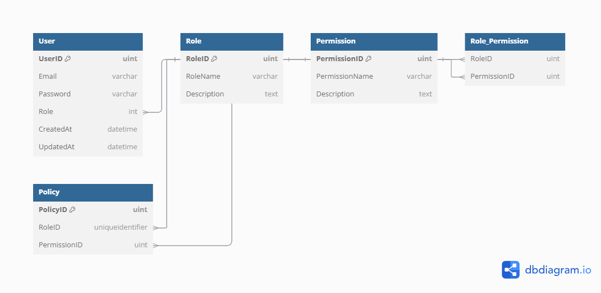

<h1>GoliPors</h1> 

## Menu

<!-- TOC -->

* [Overview](#overview)
* [Key Features](#key-features)
* [Menu](#menu)
* [Commands](#commands)
* [Project structure](#project-structure)
* [ERD](#erd)

<!-- TOC -->

# Survey Project - Documentation

## Overview

This project is a **survey management system** built with **Fiber** (a fast web framework for Go) and **Casbin** (for
role-based access control). The system allows users to create surveys, answer surveys, and manage survey data. Different
roles (Superadmin, Admin, Owner, User) have specific permissions to access and manage surveys and answers.

## Key Features

- **Survey Management**: Users can create, start, finish, and manage surveys.
- **Role-Based Access Control (RBAC)**: Different roles (Superadmin, Admin, Owner, User) are assigned specific
  permissions to manage surveys, answers, and user access.
- **Casbin**: Used for enforcing role-based permissions and access control.
- **Fiber**: Used for building the web server and handling HTTP requests.

## Commands

```bash
# Build & up containers
make up

# Down containers
make down

# To build a container. You can pass CONTAINER & FLAGS.
make build CONTAINER=container_name FLAGS=--no-cache

# Run docker attached logs.
make logs

# Rebuild all the stack
make rebuild
```

## Project structure

```bash
.
│─── cmd
│    └─── main.go
│─── api
│    │─── http
│    │    │─── server.go
│    │    └─── routes..
│    └─── service
│         └─── route services..
│─── config
│    │─── read.go   
│    └─── type.go  
│─── build   
│    │─── elk
│    │    │─── setup
│    │    │─── elasticsearch
│    │    │    │─── config
│    │    │    │    └─── elasticsearch.yml
│    │    │    └─── Dockerfile
│    │    │─── extensions
│    │    │    └─── fleet
│    │    │    │    │─── Dockerfile
│    │    │    │    └─── fleet-compose.yml
│    │    │─── logstash
│    │    │    │─── config
│    │    │    │    └─── logstash.yml
│    │    │    │─── pipeline
│    │    │    │    └─── logstash.conf
│    │    │    └─── Dockerfile
│    │    │─── kibana
│    │    │    │─── config
│    │    │    │    └─── kibana.yml
│    │    │    └─── Dockerfile
│    │    │─── docker-compose.yaml
│    │    └─── .env
│    │─── redis
│    │    ├─── docker-compose.yaml
│    │    └─── .env
│    │─── postgres
│    │    ├─── docker-compose.yaml
│    │    └─── .env
│    └─── project
│         ├─── Dockerfile
│         ├─── docker-compose.yaml
│         └─── .env
│─── internal
│    └─── services...
│─── pkg
│    ├─── adapters
│    │    ├─── cache
│    │    │    └─── redis.go
│    │    └─── storage
│    │         │─── mapper
│    │         │─── types
│    │         └─── repository files...
│    ├─── postgres
│    │    └─── gorm.go
│    ├─── cache
│    │    ├─── provider.go
│    │    └─── serialization.go
│    ├─── logger
│    └─── jwt
│         ├─── claims.go
│         └─── auth.go
│─── tests
│─── config.json
│─── sample-config.json
│─── go.mod
│─── go.sum
│─── README.md
│─── LICENSE
│─── .gitignore
└─── Makefile
```

## ERD

